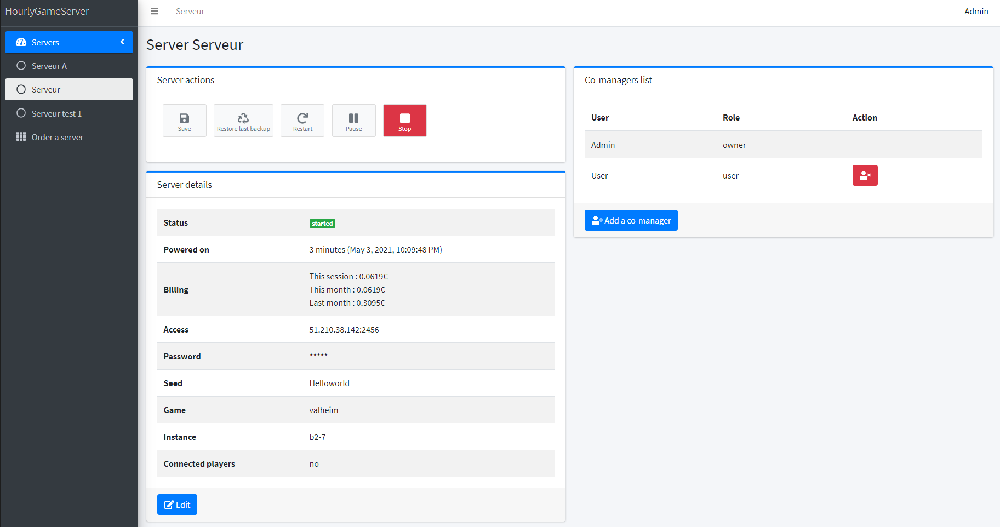

# Hourly Game Server

HourlyGameServer is a webapp than can:

-   start and stop Valheim server on Openstack instance
-   backup and restore the world from an Openstack Object Storage
-   share the manager access to another users.

It uses Kubernetes, Ansible, Terraform, Packer, PHP8 and Symfony5

## Workflow

[![](https://mermaid.ink/img/eyJjb2RlIjoiZ3JhcGggVERcbiAgICBcbiAgICBzdWJncmFwaCBTdG9wXG4gICAgICAgIFN0YXJ0ZWQgLS0-IHxhbnNpYmxlIHZoc2VydmVyIHBhdXNlfCBQYXVzZVNlcnZlcltQYXVzZSBnYW1lIHNlcnZlcl1cbiAgICAgICAgUGF1c2VTZXJ2ZXIgLS0-IHxhbnNpYmxlIHJlc3RpYyBiYWNrdXB8IEJhY2t1cFNlcnZlcltCYWNrdXAgZ2FtZSB3b3JsZF1cbiAgICAgICAgQmFja3VwU2VydmVyIC0tPiB8dGVycmFmb3JtIGRlc3Ryb3l8IFN0b3BTZXJ2ZXJbU3RvcCBzZXJ2ZXJdXG4gICAgZW5kXG5cbiAgICBzdWJncmFwaCBTdGFydFxuICAgICAgICBzdGFydFtTdGFydF0gLS0-IHx0ZXJyYWZvcm0gaW5pdHwgSW5pdFRlcnJhZm9ybVtJbml0IFRlcnJhZm9ybV1cbiAgICAgICAgSW5pdFRlcnJhZm9ybSAtLT4gfHRlcnJhZm9ybSBhcHBseSBvcGVuc3RhY2staW1hZ2V8IEJvb3RTZXJ2ZXJbQm9vdCBzZXJ2ZXJdXG4gICAgICAgIEJvb3RTZXJ2ZXIgLS0-IHx0ZXJyYWZvcm0gcmVzdWx0fCBHZXRJUFtHZXQgSVBdXG4gICAgICAgIEdldElQIC0tPiB8YW5zaWJsZSByZXN0aWMgcmVzdG9yZXwgUmVzdG9yZVNlcnZlcltSZXN0b3JlIGdhbWUgd29ybGRdXG4gICAgICAgIFJlc3RvcmVTZXJ2ZXIgLS0-IHxhbnNpYmxlIHZoc2VydmVyIHVwZGF0ZXwgVXBkYXRlU2VydmVyW1VwZGF0ZSBnYW1lIHNlcnZlcl1cbiAgICAgICAgVXBkYXRlU2VydmVyIC0tPiB8YW5zaWJsZSB2aHNlcnZlciBzdGFydHwgU3RhcnRTZXJ2ZXJbU3RhcnQgZ2FtZSBzZXJ2ZXJdXG4gICAgZW5kXG4gICAgXG4gICAgc3ViZ3JhcGggUGFja2VyXG4gICAgICAgIFN0YXJ0UGFja2VyW1N0YXJ0IHBhY2tlciBpbnN0YW5jZV0gLS0-IHxwYWNrZXIgYnVpbGR8IFVidW50dVtVYnVudHUgMjAuMDRdXG4gICAgICAgIFVidW50dSAtLT4gfGFuc2libGUgaW5zdGFsbHwgQW5zaWJsZVtBbnNpYmxlIGluc3RhbGwgbGF0ZXN0IHZoc2VydmVyXVxuICAgICAgICBBbnNpYmxlIC0tPiB8b3BlbnN0YWNrIHNuYXBzaG90fCBPU0ltYWdlW09wZW5zdGFjayBpbWFnZV1cbiAgICBlbmRcbiIsIm1lcm1haWQiOnsidGhlbWUiOiJkZWZhdWx0In0sInVwZGF0ZUVkaXRvciI6ZmFsc2V9)](https://mermaid-js.github.io/mermaid-live-editor/#/edit/eyJjb2RlIjoiZ3JhcGggVERcbiAgICBcbiAgICBzdWJncmFwaCBTdG9wXG4gICAgICAgIFN0YXJ0ZWQgLS0-IHxhbnNpYmxlIHZoc2VydmVyIHBhdXNlfCBQYXVzZVNlcnZlcltQYXVzZSBnYW1lIHNlcnZlcl1cbiAgICAgICAgUGF1c2VTZXJ2ZXIgLS0-IHxhbnNpYmxlIHJlc3RpYyBiYWNrdXB8IEJhY2t1cFNlcnZlcltCYWNrdXAgZ2FtZSB3b3JsZF1cbiAgICAgICAgQmFja3VwU2VydmVyIC0tPiB8dGVycmFmb3JtIGRlc3Ryb3l8IFN0b3BTZXJ2ZXJbU3RvcCBzZXJ2ZXJdXG4gICAgZW5kXG5cbiAgICBzdWJncmFwaCBTdGFydFxuICAgICAgICBzdGFydFtTdGFydF0gLS0-IHx0ZXJyYWZvcm0gaW5pdHwgSW5pdFRlcnJhZm9ybVtJbml0IFRlcnJhZm9ybV1cbiAgICAgICAgSW5pdFRlcnJhZm9ybSAtLT4gfHRlcnJhZm9ybSBhcHBseSBvcGVuc3RhY2staW1hZ2V8IEJvb3RTZXJ2ZXJbQm9vdCBzZXJ2ZXJdXG4gICAgICAgIEJvb3RTZXJ2ZXIgLS0-IHx0ZXJyYWZvcm0gcmVzdWx0fCBHZXRJUFtHZXQgSVBdXG4gICAgICAgIEdldElQIC0tPiB8YW5zaWJsZSByZXN0aWMgcmVzdG9yZXwgUmVzdG9yZVNlcnZlcltSZXN0b3JlIGdhbWUgd29ybGRdXG4gICAgICAgIFJlc3RvcmVTZXJ2ZXIgLS0-IHxhbnNpYmxlIHZoc2VydmVyIHVwZGF0ZXwgVXBkYXRlU2VydmVyW1VwZGF0ZSBnYW1lIHNlcnZlcl1cbiAgICAgICAgVXBkYXRlU2VydmVyIC0tPiB8YW5zaWJsZSB2aHNlcnZlciBzdGFydHwgU3RhcnRTZXJ2ZXJbU3RhcnQgZ2FtZSBzZXJ2ZXJdXG4gICAgZW5kXG4gICAgXG4gICAgc3ViZ3JhcGggUGFja2VyXG4gICAgICAgIFN0YXJ0UGFja2VyW1N0YXJ0IHBhY2tlciBpbnN0YW5jZV0gLS0-IHxwYWNrZXIgYnVpbGR8IFVidW50dVtVYnVudHUgMjAuMDRdXG4gICAgICAgIFVidW50dSAtLT4gfGFuc2libGUgaW5zdGFsbHwgQW5zaWJsZVtBbnNpYmxlIGluc3RhbGwgbGF0ZXN0IHZoc2VydmVyXVxuICAgICAgICBBbnNpYmxlIC0tPiB8b3BlbnN0YWNrIHNuYXBzaG90fCBPU0ltYWdlW09wZW5zdGFjayBpbWFnZV1cbiAgICBlbmRcbiIsIm1lcm1haWQiOnsidGhlbWUiOiJkZWZhdWx0In0sInVwZGF0ZUVkaXRvciI6ZmFsc2V9)

## Screenshot



### Build docker image

Build image

```
docker build -t hgs_php -f ./docker/php/Dockerfile --target dev .
```

### Build packer images

```
cd packer
```

[Packer Readme](packer/README.md)

### Launch terraform

```
cd terraform
```

[Terraform Readme](terraform/README.md)

### Launch playbooks

```
cd ansible
```

[Ansible Readme](ansible/README.md)
